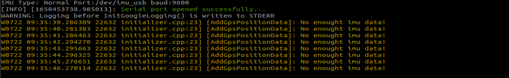
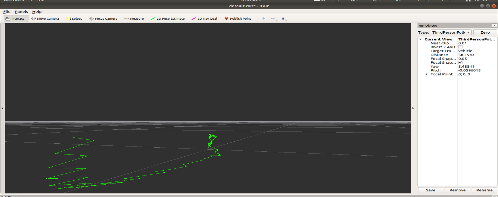

### 融合IMU和GPS数据

**该功能融合IMU和GPS数据，并且在rviz中展示融合后的数据。**

**注意以下几点：**

**（1）、该功能需要将购买的IMU和GPS模块通过两条数据线接在主控上。**

**（2）、需要有两个工作空间，gps_ws和imu_ws，它们的源码在当前目录下，对应的是gps_src和imu_src。gps_src解压后，把gps_src里边的src里边的内容复制到gps_ws的src中，然后使用catkin_make编译它；imu_src解压后，把imu_src里边的src里边的内容复制到imu_ws的src中，然后使用catkin_make编译它。这一步骤可以参看虚拟机里边的gps_ws和imu_ws。**

数据融合需要有两个话题的数据，/imu/data和/fix。这两个数据我们可以通过启动IMU和GPS模块来获取。终端输入，

```
roslaunch imu_gps_localization imu_gps_test.launch
```

来看看这个launch的具体内容，

```xml
<launch>
    <param name="acc_noise"       type="double" value="1e-2" />
    <param name="gyro_noise"      type="double" value="1e-4" />
    <param name="acc_bias_noise"  type="double" value="1e-6" />
    <param name="gyro_bias_noise" type="double" value="1e-8" />

    <param name="I_p_Gps_x"       type="double" value="0.0" />
    <param name="I_p_Gps_y"       type="double" value="0.0" />
    <param name="I_p_Gps_z"       type="double" value="0.0" />
    <param name="log_folder"      type="string" value="$(find imu_gps_localization)" />

	<!--GPS-->
    <include file="$(find nmea_navsat_driver)/launch/nmea_serial_driver.launch"/>

	<!--IMU-->
    <include file="$(find wit_ros_imu)/launch/rviz_and_imu.launch"/>

    <node name="imu_gps_localization_node" pkg="imu_gps_localization" type="imu_gps_localization_node" output="screen" />

    <node pkg="rviz" type="rviz" name="rviz" output="screen" 
      args="-d $(find imu_gps_localization)/ros_wrapper/rviz/default.rviz" required="true">
    </node>

</launch>
```

可以看出，启动了**nmea_serial_driver.launch**，这是用来**获取GPS数据并且发布/fix数据**；启动了**rviz_and_imu.launch**，这是用来**获取IMU数据，并且发布/imu/data**；最后，启动了**imu_gps_localization_node**，这个节点**订阅了/fix和/imu/data话题，得到数据后，就开始进行融合，最后发布出/fused_path的数据**，可以通过rostopic list查看话题列表，也可以通过rosrun rqt_graph rqt_graph来查看节点之间的关系。



**注意：程序启动后，会提示出不够IMU数据，这时候只需要耐心等待一下，过一会儿就会看到这个警告消失了，随后就会打印出数据融合后的路径。**

