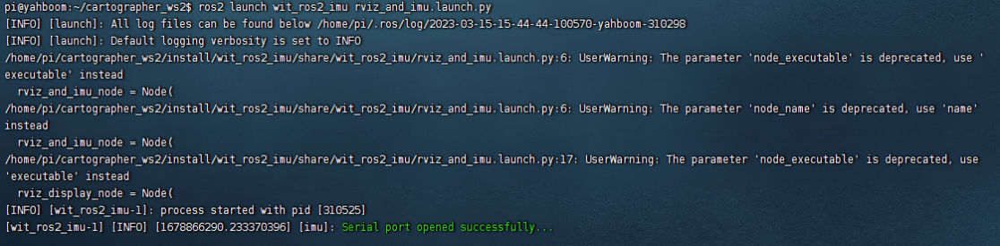

## 环境搭建

本节课程说明如何在ros2中搭建十轴IMU模块环境，其中包括编译功能包、绑定串口、运行程序并查看数据。本节以ubuntu20.04+ros-foxy，功能空间名字以WitImu_ws为例，默认波特率是9600。

### 1、编译功能包

建立一个工作空间WitImu_ws并且在该目录下新建一个src文件夹存放功能包，终端输入，

```bash
mkdir WitImu_ws
cd WitImu_ws
mkdir src
```

然后，解压文件，得到wit_ros2_imu文件夹，把它复制到刚才建立的src目录下，然后回到工作空间目录下，使用colcon build命令进行编译，终端输入，

```bash
cd ~/WitImu_ws
colcon build
```

然后把工作空间的路径加入到.bashrc中，终端输入，

```bash
sudo vim ~/.bashrc
source ~/WitImu_ws/install/setup.bash #把这句加在最后边，这里的我工作空间是在~目录下的，根据自己的工作空间目录进行修改
```

### 2、绑定串口

为了防止多个usb设备同时插入的时候，系统识别错误，我们给该模块的串口名字绑定成/dev/imu_usb，终端输入，

```bash
cd ~/WitImu_ws/src/wit_ros_imu
sudo chmod 777 bind_usb.sh
sudo sh bind_usb.sh
```

重新插拔连接IMU模块的USB数据线。以生效绑定的端口，输入以下指令检测绑定端口是否成功，

```bash
ll /dev/imu_usb
```


不一定是ttyUSB0，只要显示是USB设备就行了。

### 3、运行测试

终端输入，

```bash
ros2 launch wit_ros2_imu rviz_and_imu.launch.py 
```



使用ros2 topic echo 工具可以看发布的数据的具体内容，终端输入，

```
ros2 topic echo /imu/data
```


### 4、修改波特率

程序默认是使用9600的波特率，如果在上位机修改了波特率，那么则需要修改源码中的波特率，源码修改波特率的位置是，~/WitImu_ws/src/wit_ros2_imu/wit_ros2_imu/wit_ros2_imu.py

```python
#149行
def driver_loop(self, port_name):
# 打开串口
	try:
		wt_imu = serial.Serial(port="/dev/imu_usb", baudrate=9600, timeout=0.5)
```

把9600改成上位机上修改的波特率，然后保存后退出，最后回到工作空间目录下进行编译即可。