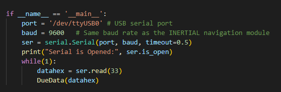
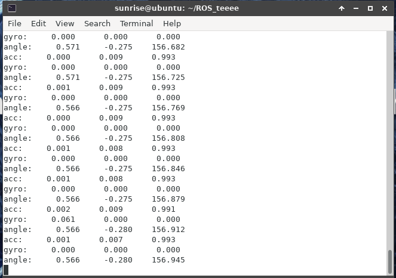

## X3派-USB应用例程

[toc]

需要准备的产品：Win10电脑、IMU模块、Type-C数据线、X3派开发套件。

### 一、硬件连接

使用Type-C数据线将IMU模块和X3派的USB口连接起来。


### 二、软件编程

具体代码请看资料中的源码。

如果连接的USB设备不止一个，请查看并确认IMU模块的USB设备号，并修改port的值。

程序中已经设置USB的波特率baud=9600，根据IMU模块的波特率，修改baud的值。



### 三、安装串口驱动库

如果Python3里没有安装serial串口驱动库，请运行以下命令安装。

```shell
pip3 install pyserial
```

### 四、实验效果

将imu_usb.py文件导入到系统中，打开终端，进入对应文件夹，然后运行以下命令：

```shell
sudo python3 imu_usb.py
```
再输入密码后（密码就是登录的密码，默认为：sunrise）

可以看到终端一直打印IMU模块的数据，当改变IMU模块的姿态，数据会跟着变化。

