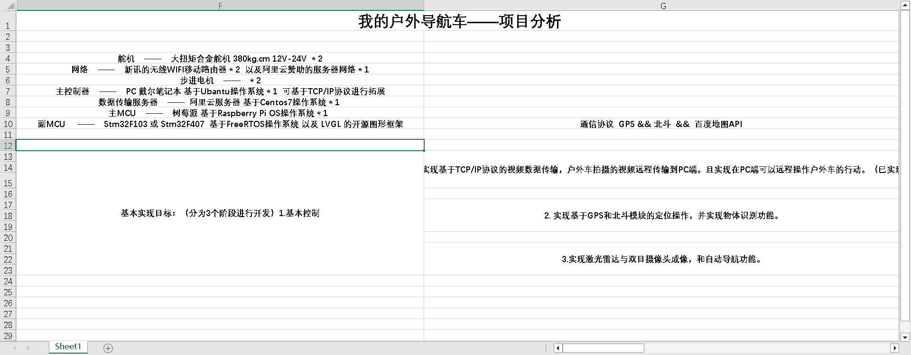

# My-Outdoor-Autonomous-Vehicles
自制——户外导航车
本人和导师自己做的一个小项目，当然如果你也对此感兴趣，也可以一起交流一下：QQ：1697556601@qq.com，如果有任何侵犯权益的地方，随时可以联系本人。
  项目迭代版本以及自己的一些记录。
  ## 版本1.0
			——   选材及硬件配置如下所示：


操作系统的话，基本上都是Linux或者是RTOS了，给自己上点强度。不过也确实是好使。和win10比也算是轻量级的操作系统了。

电机和舵机的话，也是第一次遇见这么大扭矩的家伙。

截至2023年5月20日（到晚上才发现今天这日子不一般）一定是我学习太认真了😁。

## 项目目录现在如下所示:  (以后应该会不断的进行补充)


## 理一下思路：

	先梳理一下当下的开发思路，网络截至到现在除了图像比较小之外，应该是比较稳定了，连续传个几千帧图像是没有问题的。

下一步就是去优化一下图像的传输，由于现在采取的都是单进程，或者多线程，但是python3的多线程是有一个**GIL（Global Interpreter Lock(全局解释器锁)）**存在的，所以他虽然叫多线程，但实际上还是一个单线程，可能用的不好还不如单线程呢，

所以接下来就是去学习一下多进程该怎么使用，使用进程和线程进行配合来提高接收UDP数据包和处理UDP数据包的速度。

至于为什么说只加速UDP的接收和处理速度呢，因为在实验过程之发现服务器接收和发送图片的帧数远比接收到的多的多，基本上4帧才能收到一帧，如果这几帧都能显示出来的话，那图像得多丝滑啊。想想就兴奋啊。搞完了图像传输之后，控制部分我们先放一放，虽然流量卡和服务器还在计费，但是没有实物也没法验证远程控制好不好使啊。

所有暂时放下网络这块，去研究舵机和步进电机的使用和驱动，先让车从零动起来再说控制，之后就是进阶研究步进电机的启动方式，记得以前见过什么梯形加减速算法，应该可以借鉴借鉴，毕竟这么一个电机如果开始就给一个大的驱动力，那肯定是对电机的损伤比比较大的，人跑个步还得做做热身，防止拉伤呢，何况是这种大铁头呢。

暂时就这么多，之后的东西应该就到了第二版了。也就是第二阶段遇到的问题了，暂时就想到这么多了，没有实践说什么也是白扯。

第一版总结时间:2023/5/20 。


## 版本2.0

	截至至2023年5月31日作为11：47分，项目进展比较顺利，中途遇见不少问题，但是还好基本上都解决了。

目前，网络部分基本框架已经完成，对之前的方式进行了一个重构，之前的启动方式过于复杂，客户端之间还有启动顺序，几天没用自己都忘了怎么开，一气之下直接重构了一下系统，对启动方式进行了一个整改，启动方式放最后了。

网络通信的过程大体为：PC通过阿里云向树莓派发信息再转发到Stm32，整个链接过程看起来有点脆弱，只要一个环节出错直接完蛋，但是没有办法，这能是这样了，想要没有距离的限制，只能是通过网络，所以暂时先这样，至于数据校验部分还现在没有写，计划使用正则匹配来判断数据的正确性，采用数据帧的方式来发送数据，对数据进行封装，后期加入加密算法，对数据进行加密，防止被人轻轻松松直接拿到原始数据，车直接被人控制着开回家了。这不就搞笑了吗，所以对数据加密还是有必要的。目前还没确定数据格式使用什么比较好，暂时想到一个格式是

```c
帧头 + 数据长度 + 数据 + 帧尾
```

不知道效果咋样，现在使用的直接发送原始数据。且中图没有丢包校验。一次收不到，就多按几次键盘，这奇怪的是我用TCP作为控制协议，但是他居然丢包，我拿UDP都不丢，TCP居然丢包率更高。想不通啊想不通。

至于控制部分，步进电机采用了T型加减速算法，来保护电机，和防止启动时整个车架承受一个比较大的力，对这个启动过程做一个缓冲，效果还可以，写了个这个基本上把定时器和中断研究明白了，这个步进电机T型加减速遇到了一堆的问题，第一个就是怎么写，网上资料很多，就不说了，网上基本上都是HAL库的，但是想要效率使用HAL库是不太行的，封装太多了，所以将HAL移植为库函数，发现好使，之后移植上FreeRTOS系统，发现只要开启步进电机的任务，其他进程就会卡死，调整抢占算法，轮询算法都不好使，改栈大小什么的都不好用，又改为库函数，一开始认为是这个算法占用定时器资源太多了，导致其他的函数根本执行不了，所以又将库函数改为了寄存器的版本，还是不行，辗转反侧，网上根本没有这块的问题，但所幸有一篇是关于这个问题的，将编译器的优化等级从0提高为1，发现仍然不行，最后怀疑是定时器配置问题，各种改配置，不行，最后发现是中断类型的问题，在定时器中断中有一个更新中断，应该改为比较中断，至此这个卡了小半周的问题算是解决了，但是目前24V的电压加上新驱动器带不动这个步进电机，怀疑是电压不够，新电池还在路上。至于LVGL还没移植，实在是有点大，不知道芯片能不能抗住，现在多了一个想法是，添加一个开机动画，查百度时发现一个赛博朋克的进度条，很炫。不过为了一个开机动画要学一个Fatfs文件系统。配合SD卡，实现更多效果的展示，挺简单的一个系统越做越复杂了，加上内存卡，之后便可以将一些控制数据放入SD卡了，显得工业级一点了。更合理了。

附：

启动方式:

```python
先打开服务器，之后PC和树莓派随意 然后会在树莓派看到提示输入99开始传输数据，这块每100帧给一个提示，说明连接还在，在按一个99停止数据的传输，

阿里云服务器的文件路径：/home/test/chonggou下的xintiao.py  tcptest.py smpServer.py
树莓派的文件路径：/home/pi/python/xm   下的tcptest.py  usart_send.py
PC文件路径: /xintiao.py  tcp_test.py
```

控制部分目前状态：加入了数据的接收，这块用的是串口，舵机的控制，步进电机的控制。目前在学Fatfs文件操作系统和内存管理，下一步加入FreeRTOS系统，提高系统的实时性，之后加入LVGL进行GUI界面的编写。

树莓派部分现在还没有加入双目摄像头的测距以及物体识别和GPS+IMU的惯导路径获取。

PC的GUI控制现在用的是pygame库，控制只有一个黑框，看看最后能不能用pyqt做一个高级的控制界面，前几天还看到了Unity3D可以接入串口数据进行展示，可以对车进行一个建模动画显示出状态，正好也有imu得到姿态。

至此这10天的工作总结基本完成了。